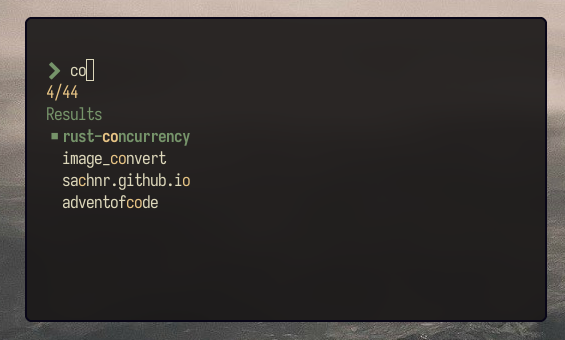

# Tmux-fzy

A simple project manager for tmux.

# Screenshot



# Installation

## From source

```
cargo build --release
cargo install --path . --force
```

make sure you have `.cargo/bin` in your path

`export PATH="${PATH}:$HOME/.cargo/bin"`

# Usage

how to add dirs

```
tmux-fzy add --mindepth 1 --maxdepth 1 ~/Music
```

### color cutomization _(optional)_

add ansi color codes 0-15 in `~/.config/tmux-fzy/config`

```
fg=15
border=15
inactive=8
active=1
selection=2
```

_paths are stored in `XDG_CACHE_HOME/.tmux-fzy`_
